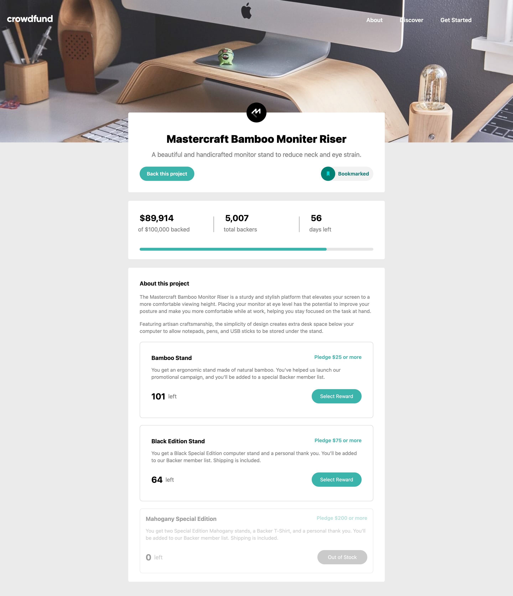
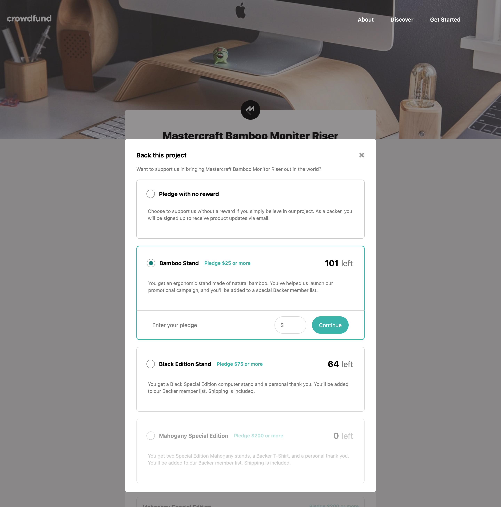
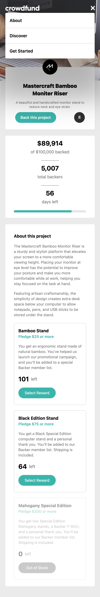
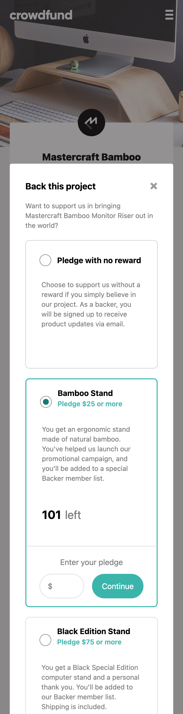

# Frontend Mentor - Crowdfunding product page solution

This is a solution to the [Crowdfunding product page challenge on Frontend Mentor](https://www.frontendmentor.io/challenges/crowdfunding-product-page-7uvcZe7ZR). 


## Table of contents

- [Overview](#overview)
  - [The challenge](#the-challenge)
  - [Quick start](#quick-start)
  - [Screenshot](#screenshot)
  - [Built with](#built-with)
  - [🧗‍♀️ What I learned](#🧗‍♀️-what-i-learned)

## Overview

### The challenge

Users should be able to:

- View the optimal layout depending on their device's screen size
- See hover states for interactive elements
- Make a selection of which pledge to make
- See an updated progress bar and total money raised based on their pledge total after confirming a pledge
- See the number of total backers increment by one after confirming a pledge
- Toggle whether or not the product is bookmarked

---
<strong> 🚀 Bonus feature:</strong>
- See the "pledge stock" decrement by 1 after confirming a pledge

---

### Quick Start
1. Clone this git repository to your local machine and open it on VSCode.
2. Run in VSCode integrated terminal:
```
> npm install
```
3. To open the live site on your local machine:
```
> npm run dev
```
4. To create deployment ready site:
```
> npm run build
```
---

### Screenshot

#### Desktop 1044px
|     <a href="screenshots/Desktop1440.png"></a>   |
| ---------------------------------------------- |
|     <a href="screenshots/Desktop1440-modal.png"></a> |

#### Mobile 375px
|     <a href="screenshots/Mobile375-half.png"></a>   |
| ---------------------------------------------- |
|     <a href="screenshots/Mobile375-modal.png"></a>  |


### Built with

- Semantic HTML5 markup
- CSS custom properties
- Flexbox
- CSS Grid
- Mobile-first workflow
- [React](https://reactjs.org/) - JS library
- Tailwind CSS

### 🧗‍♀️ What I learned
1. Getting Error "Form submission canceled because the form is not connected" in React

   This error usually happens when a button of type `submit` is not inside a `<form>` or the form is improperly structured.

   Ref: https://stackoverflow.com/a/52878563

2. Navbar using Tailwind

   Easy-to-use responsive navbar components are available via Flowbite.

   Ref: https://flowbite.com/docs/components/navbar/

3. Apply CSS on child when hovering on parent

```jsx
<button className=" hover:cursor-pointer group ">
  
</button>
```

Ref: https://stackoverflow.com/a/75041866

4. Select radio button (siblings / descendents) from cousin/parent element. 
Eg, we want to allow users to be able to select radio option by clicking on its neighboring html elements.

Here, we use the id to set state.
```jsx
function handleSelected(event) {
  setSelected(() => {
    const targetId = event.target.id;
    const curSelectionId = targetId.split("-")[0];
    return curSelectionId;
  });
}
```

Here, we set id on each elements we want to be able to handle click from.
```jsx
<div id={`${id}-div1`}
  // handle click in parent element here!
  onClick={handleSelected}>

  {/* radio button--> what we want to select */}
  <div id={`${id}-div2`} className="p-3">
    <label id={`${id}-label`}>
      <input
        onChange={handleSelected}
        checked={selected === id ? true : false}
        type="radio"
        name="pledge-option"
        value={id}
        id={id}
        disabled={remaining > 0 ? false : true}
      />
      <div id={`${id}-div4`}></div>
    </label>
  </div>

  <div id={`${id}-div5`}>
    <h3 id={`${id}-title`}>
      {title}
    </h3>
    <h4 id={`${id}-subtitle`}>
      {subtitle}
    </h4>
  </div>
</div>
```

5. How to format thousands separator

```js
var n = 34523453.345;
console.log(n.toLocaleString());  // "34,523,453.345"
```

Ref: https://stackoverflow.com/a/17663871

6. To apply Google Font as default font using Tailwind

```css
// in index.css

@import url("https://fonts.googleapis.com/css2?family=Commissioner:wght@100..900&display=swap");
@import "tailwindcss";

@layer {
  html {
    font-family: "Commissioner", sans-serif;
  }
}
```

Ref: https://stackoverflow.com/a/77714572

7. We can't update Tailwind class dynamically, so have to use inline styles

Eg here we want to dynamically set the width of a div (eg of a progress bar) based on `amount`.
We first hardcoded the width using tailwind `w-[89%]` then update based on `amount` using inline styles.

```jsx
export default someDiv(props) {

  const {amount} = props;

  // get only first 2 most significant digit, transform into string, add '%'
  const updatedValStr = amount.toLocaleString().split(",")[0] + "%";

  const styles = {
    width: updatedValStr,
  };

  return (<div style={styles} className="w-[89%]"></div>)
}
```

Ref: https://stackoverflow.com/a/76789660

8. Pass data from child to parent (might be useful for future read).

Ref: https://medium.com/@ozhanli/passing-data-from-child-to-parent-components-in-react-e347ea60b1bb#:~:text=One%20way%20to%20pass%20data,pass%20up%20to%20the%20parent.


